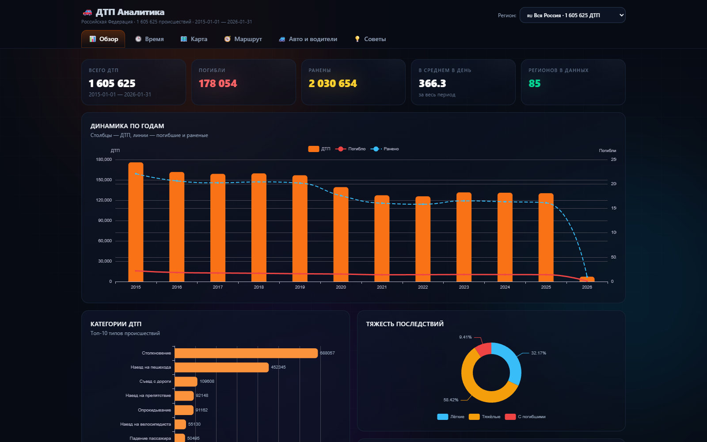
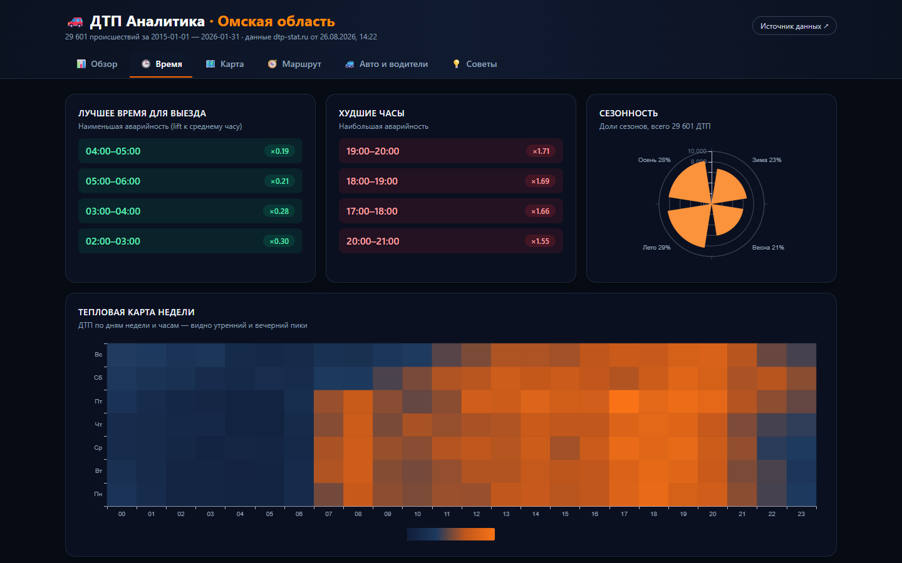
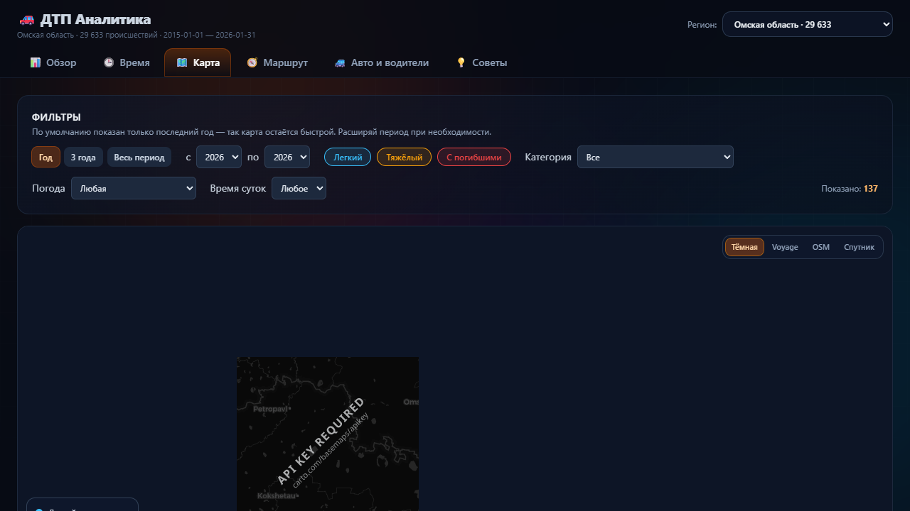
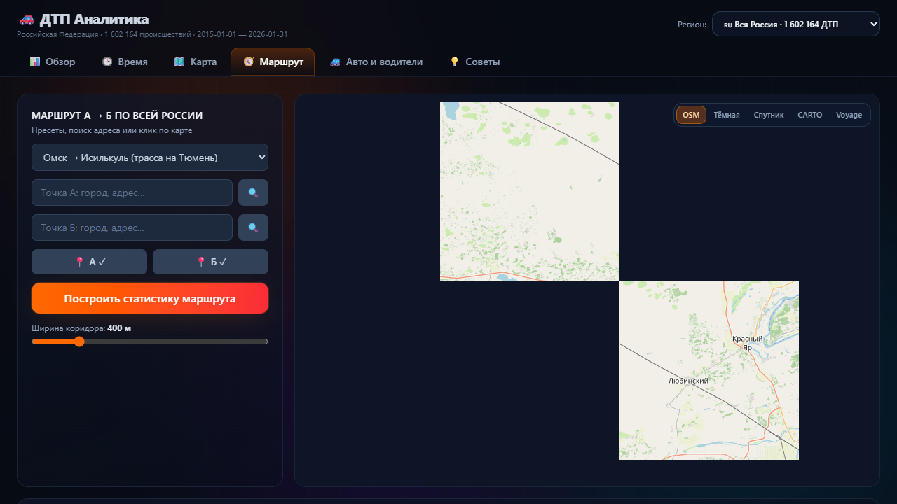
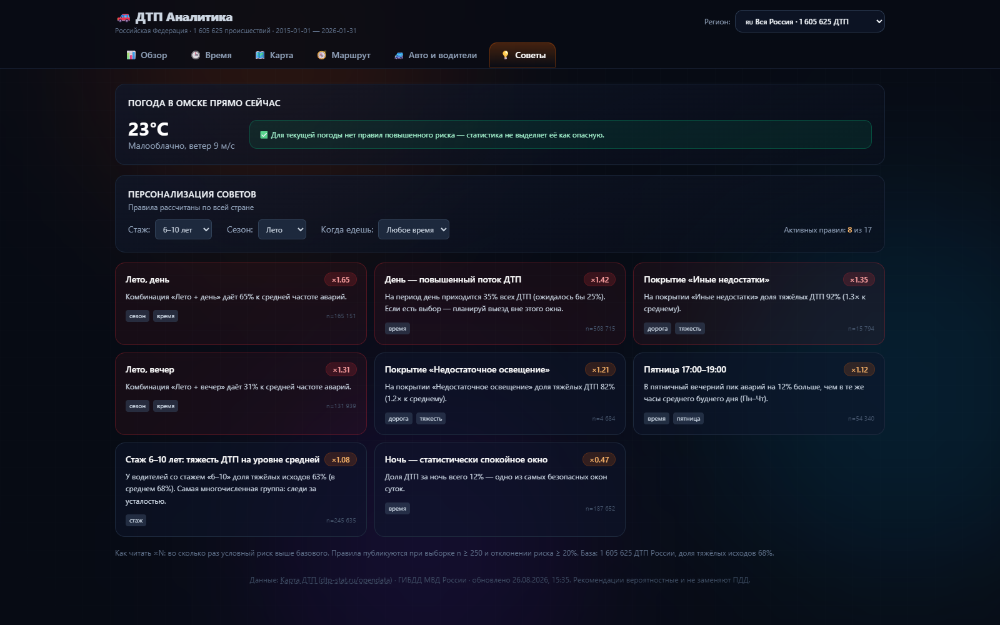
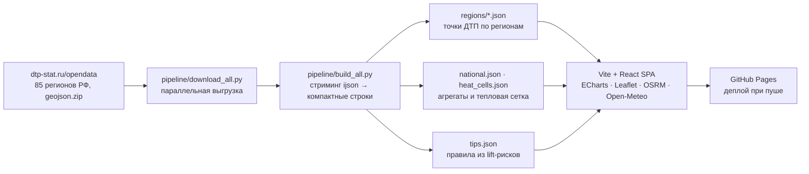

# 🚗 ДТП Аналитика · Вся Россия

[](https://github.com/cwjechw98-lang/dtp-analitycs/actions/workflows/deploy.yml)
[](https://github.com/cwjechw98-lang/dtp-analitycs/actions/workflows/update-data.yml)
[](web/src/lib/__tests__)


> **Интерактивный дашборд аварийности по всем регионам России: 1,6 млн ДТП за 2015–2026.**
> Тепловая карта страны · виновники по маркам авто · лучшие и худшие часы выезда ·
> погода и сезонность · стаж водителей · советник маршрута А→Б с персональными рекомендациями.

**🔗 Открыть дашборд:** [https://cwjechw98-lang.github.io/dtp-analitycs/](https://cwjechw98-lang.github.io/dtp-analitycs/)

---

## ✨ Что внутри

| Вкладка | Возможности |
|---|---|
| 📊 **Обзор** | KPI с анимированными счётчиками, динамика по годам (ДТП/погибшие/раненые), топ категорий, тяжесть, погода и покрытие дорог — по всей стране или выбранному региону |
| 🕒 **Время** | Тепловая карта «день недели × час», **лучшие и худшие часы выезда**, месячная динамика по годам, сезонная полярная диаграмма, время суток × тяжесть |
| 🗺️ **Карта** | Режим «Вся Россия»: плотность ДТП ячейками ~5×5 км. Режим региона: кластеры точек с фильтрами (годы, тяжесть, категория, погода, время суток) и деталями по клику |
| 🧭 **Маршрут** | Любой маршрут по стране: точки подтягиваются из всех пересекаемых регионов; статистика коридора ±150–1500 м + **персональные рекомендации под твой стаж** |
| 🚙 **Авто и водители** | ⚠️ **Кто виновник: марки-лидеры** (виновник vs пострадавший), топ нарушений ПДД виновников, марки-участницы ДТП, связь стажа с тяжестью исходов и ночными поездками |
| 💡 **Советы** | База правил относительного риска: фильтры по стажу/сезону/времени; карточка текущей погоды Омска (Open-Meteo) с автоматической оценкой риска |

### Кто виновник?

Для каждого водителя в датасете записан список нарушений ПДД. Мы считаем водителя
**виновником**, если в его записи есть нарушение (запись `«Нет нарушений»` = пострадавший).
Отсюда:

- рейтинг марок «виновник ↔ жертва» и коэффициент агрессивности `culprit / victim`;
- топ конкретных нарушений по всей стране;
- в режиме региона — свой рейтинг марок-виновников.

> Это **статистическая оценка** по открытым данным, а не судебное решение о виновности.

### Пример работы советника маршрута

Пресет «Омск → Исилькуль»: 142 км трассы, ~1 000 ДТП в коридоре ±400 м, зелёные окна
выезда ночью, красный вечерний пик и правила риска, действующие именно на этом направлении.

## 🖼️ Скриншоты

<!-- Обновляются скриптом docs/screenshot.ps1 после релизов -->

| Обзор · вся Россия | Время |
|---|---|
|  |  |
| **Карта · плотность по стране** | **Маршрут А→Б** |
|  |  |
| **Авто · виновность по маркам** | **Советы + погода** |
|  |  |

## 🧠 Как это работает



- **Данные** — открытая выгрузка [Карта ДТП](https://dtp-stat.ru/opendata/)
  (первичный источник — ГИБДД МВД России). Источник охватывает **только регионы РФ**:
  данные по Казахстану и другим странам СНГ в нём не публикуются.
- **Пайплайн** — стриминговый разбор JSON (`ijson`) не держит сырые гигабайты в памяти;
  на выходе ~87 МБ компактных JSON: строки ДТП по 16 полей с округлением координат,
  геохэш-сетка 5×5 км, национальные агрегаты, матрица виновников, словари.
- **Советы** — правило публикуется только при выборке **n ≥ 250** (для сезонных n ≥ 400)
  и риске от **×1.2** к базовому. Только частоты, никакой магии.
- **Тесты** — vitest покрывает коридор маршрута (геометрия ±буфер), декодер geohash,
  сезонность/время суток и клиентские агрегаты (`npm test`, шаг CI).

### Методология признаков

Время суток: Ночь 23–06 · Утро 06–12 · День 12–18 · Вечер 18–23. Сезоны календарные.
Тяжесть: Лёгкий / Тяжёлый / С погибшими (как в источнике). Стаж берётся из поля
`years_of_driving_experience` (заполнен у ~93% водителей). Координаты точек округлены
до ~11 м, тепловая сетка — до ячеек ~4.9×4.9 км.

## 🚀 Быстрый старт

```bash
# 1. Данные (Python 3.12+, ~3.7 ГБ свободного места)
cd pipeline
pip install -r requirements.txt
python download_all.py         # все регионы dtp-stat → data/raw/
python build_all.py            # агрегаты → ../web/public/data/

# 2. Дашборд (Node 20+)
cd ../web
npm install
npm test                       # unit-тесты (vitest)
npm run dev                    # http://localhost:5173/dtp-analitycs/
npm run build                  # прод-сборка в dist/
```

## 🔄 Обновление данных

Автоматически: воркфлоу `update-data.yml` каждый понедельник скачивает свежую выгрузку
по всем регионам, пересобирает наборы и коммитит изменения — деплой Pages запускается сам.
Вручную: `Actions → Weekly data update → Run workflow`.

## 🧱 Технологии

Python (ijson, потоковый разбор) · Vite · React 18 · TypeScript · Tailwind CSS 4 ·
Framer Motion · Apache ECharts · Leaflet + markercluster · OSRM API · Nominatim ·
Open-Meteo · Vitest · GitHub Actions + Pages

## 🗺️ Roadmap

- [ ] AI-советник: LLM поверх агрегатов по ключу пользователя
- [ ] Сглаженная heatmap-интерполяция для карты страны
- [ ] Сохранение маршрутов и сравнение альтернативных трасс
- [ ] Экспорт отчёта по маршруту в PDF

## 📜 Лицензия и данные

Код — [MIT](LICENSE). Данные принадлежат проекту
[Карта ДТП](https://dtp-stat.ru/) (сбор данных — ГИБДД МВД России) и используются в
соответствии с условиями их публикации.

> ⚠️ **Дисклеймер.** Оценки виновности и рекомендации носят вероятностный характер и
> построены на исторических данных: они не являются правовыми выводами, не гарантируют
> безопасность и не заменяют Правила дорожного движения, здравый смысл и прогноз погоды.
