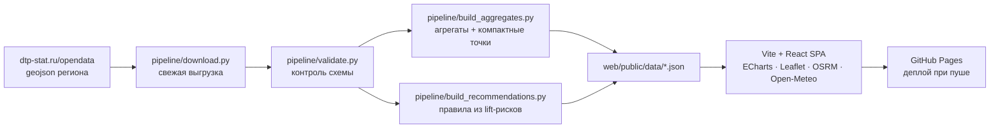

# 🚗 ДТП Аналитика · Омская область

[](https://github.com/cwjechw98-lang/dtp-analitycs/actions/workflows/deploy.yml)
[](https://github.com/cwjechw98-lang/dtp-analitycs/actions/workflows/update-data.yml)


> **Интерактивный дашборд по аварийности с персональным советником маршрута.**
> ~30 000 ДТП за 2015–2026 · лучшие и худшие часы выезда · погода и сезонность ·
> автомобили и стаж водителей · маршрут А→Б с рекомендациями «когда ехать».

**🔗 Открыть дашборд:** [https://cwjechw98-lang.github.io/dtp-analitycs/](https://cwjechw98-lang.github.io/dtp-analitycs/)

---

## ✨ Что внутри

| Вкладка | Возможности |
|---|---|
| 📊 **Обзор** | KPI-карточки, динамика по годам, топ категорий ДТП, тяжесть последствий, погода и покрытие дорог |
| 🕒 **Время** | Тепловая карта «день недели × час», **лучшие и худшие часы для выезда**, месячная динамика, сезонность, связь времени суток с тяжестью |
| 🗺️ **Карта** | Все точки ДТП кластеризованы; фильтры по годам, тяжести, категории, погоде и времени суток; клик по точке → детали: освещение, дорога, марка авто, **стаж водителя**, погибшие и раненые |
| 🧭 **Маршрут** | Выбери точки А→Б (пресет, поиск адреса или клик по карте) — получишь статистику вдоль коридора: часы риска, месяцы, сезоны, типы аварий, марки машин + **персональные рекомендации под твой стаж** |
| 🚙 **Авто и водители** | Рейтинги марок и моделей-участниц ДТП, возраст автомобилей, корреляции стажа вождения с тяжестью исходов и ночными поездками |
| 💡 **Советы** | База правил из относительных рисков: выбери стаж, сезон и время — получи ранжированные рекомендации; карточка текущей погоды Омска с оценкой риска |

### Пример работы советника маршрута

Выбираешь «Омск → Исилькуль (трасса на Тюмень)», указываешь стаж 15 лет — и видишь:
зелёные окна выезда, красные часы пик вдоль трассы, что чаще всего разбивают на этом
направлении и какие правила риска действуют именно там («пятничный вечер», «тёмное время
суток», конкретная погода).

## 🖼️ Скриншоты

<!-- добавляются из docs/screenshots -->

## 🧠 Как это работает



- **Данные** — официальная открытая выгрузка [Карта ДТП](https://dtp-stat.ru/opendata/)
  (проект собирает данные ГИБДД). Пайплайн скачивает её заново, а не хранит в репозитории.
- **Агрегаты** — Python превращает сырые 68 МБ в компактные JSON (~1.6 МБ): временные профили,
  словари погоды/дорог/освещения, точки с округлением координат.
- **Советы** — правило публикуется только если выборка достаточно велика (**n ≥ 250**) и условный
  риск отличается от среднего минимум на **20%** (lift ≥ 1.2). Никакой магии — только частоты.
- **Маршрут** — геометрия через публичный OSRM, отбор ДТП в коридоре ±400 м от полилинии,
  вся аналитика считается в браузере за миллисекунды.

### Методология признаков

Время суток (астрономическое приближение): Ночь 23–06 · Утро 06–12 · День 12–18 · Вечер 18–23.
Сезоны календарные. Тяжесть нормализуется в три класса: Лёгкий / Тяжёлый / С погибшими.
Стаж вождения берётся из поля `years_of_driving_experience` датасета (заполнено у ~93% водителей).

## 🚀 Быстрый старт

```bash
# 1. Данные (Python 3.12+)
cd pipeline
pip install -r requirements.txt
python download.py            # свежая выгрузка dtp-stat
python validate.py            # контроль схемы
python build_aggregates.py    # агрегаты → web/public/data/
python build_recommendations.py

# 2. Дашборд (Node 20+)
cd ../web
npm install
npm run dev                   # http://localhost:5173/dtp-analitycs/
npm run build                 # прод-сборка в dist/
```

## 🔄 Обновление данных

Автоматически: воркфлоу `update-data.yml` каждый понедельник скачивает свежую выгрузку,
пересобирает агрегаты и коммитит изменения — деплой Pages запускается сам.

Вручную: `Actions → Update data (weekly) → Run workflow`.

## ➕ Добавить свой регион

1. Найди свой регион на [dtp-stat.ru/opendata](https://dtp-stat.ru/opendata/) —
   например `novosibirskaia-oblast.geojson.zip`.
2. В `pipeline/download.py` поменяй `SOURCE_URL`.
3. В `pipeline/build_aggregates.py` поправь границы `BBOX` (широты/долготы региона).
4. Запусти пайплайн и обнови заголовок в `web/index.html` / `App.tsx`.

## 🧱 Технологии

Python (pandas) · Vite · React 18 · TypeScript · Tailwind CSS 4 · Apache ECharts ·
Leaflet + markercluster · OSRM API · Nominatim · Open-Meteo · GitHub Actions + Pages

## 🗺️ Roadmap

- [ ] AI-советник: LLM поверх агрегатов по ключу пользователя (архитектура готова)
- [ ] Справочные изображения автомобилей рядом со статистикой марок
- [ ] Сохранение маршрутов (localStorage → опционально Supabase)
- [ ] Селектор регионов: Новосибирская, Тюменская области
- [ ] Экспорт отчёта по маршруту в PDF

## 📜 Лицензия и данные

Код — [MIT](LICENSE). Данные принадлежат проекту
[Карта ДТП](https://dtp-stat.ru/) (сбор данных — ГИБДД МВД России) и используются в
соответствии с их условиями публикации.

> ⚠️ **Дисклеймер.** Рекомендации носят вероятностный характер и построены на исторических
> данных: они не гарантируют безопасность и не заменяют Правила дорожного движения,
> здравый смысл и прогноз погоды.
