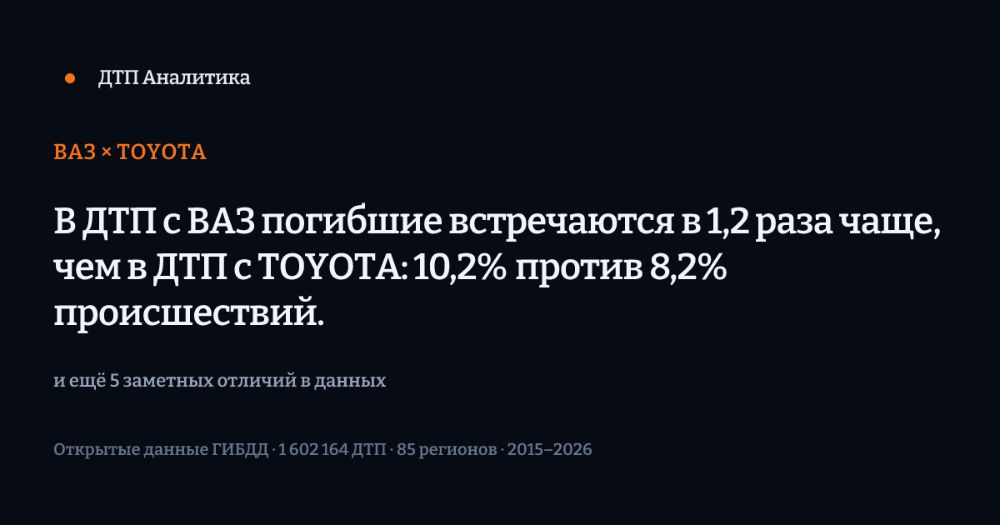
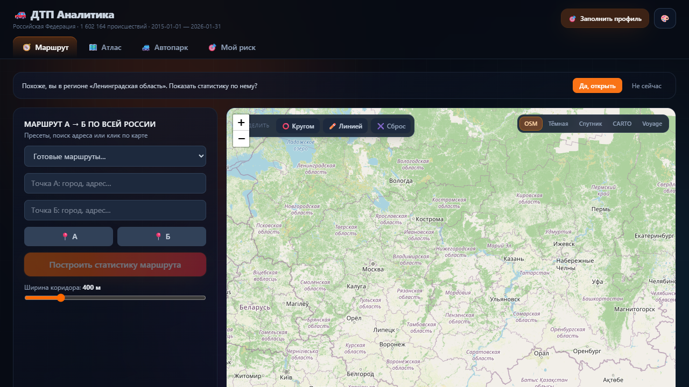
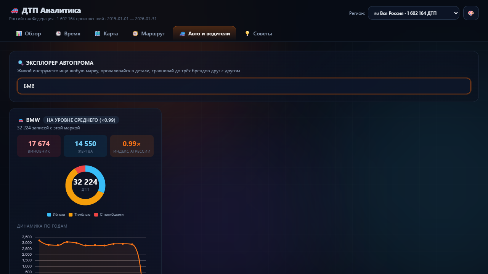
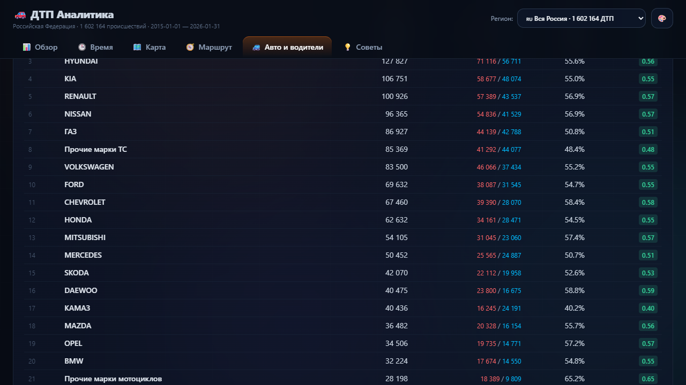
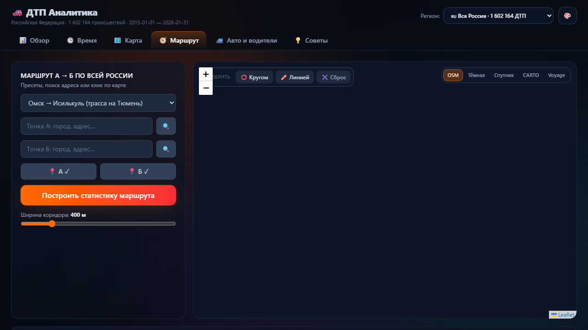
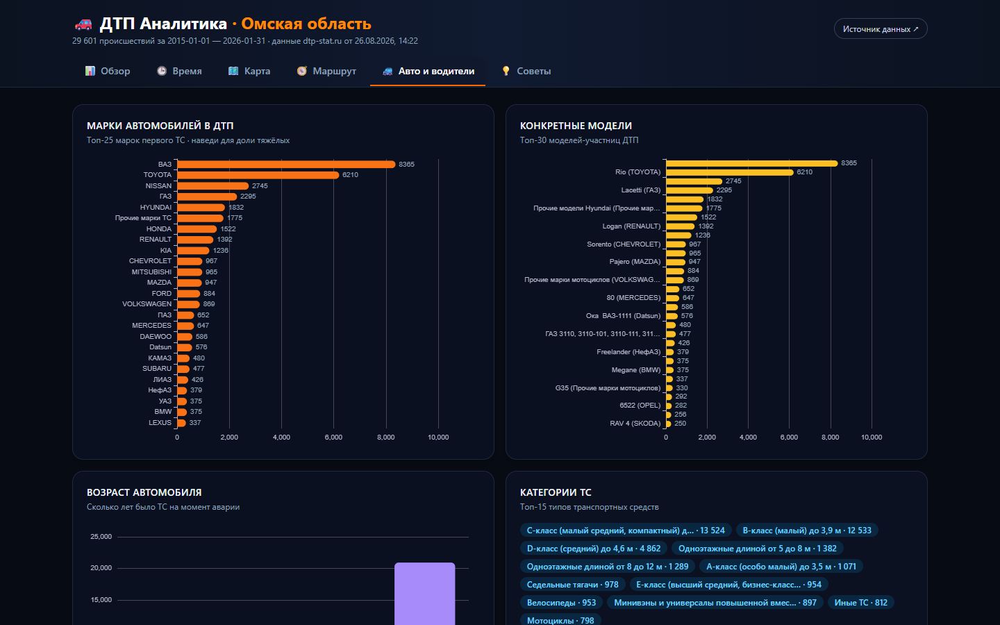
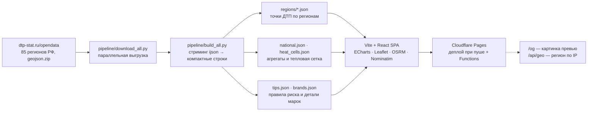

# 🚗 ДТП Аналитика · Вся Россия

[](#деплой)
[](#зеркало-github-pages)
[](web/src/lib/__tests__)


> **Интерактивный инструмент аварийности по всем регионам России: 1,6 млн ДТП за 2015–2026.**
> Карточка-вердикт для пары марок · движок находок · OG-превью в Telegram ·
> советник маршрута А→Б · гео-охват и динамика по маркам.

**🔗 Открыть:** [https://dtp-analitycs.pages.dev](https://dtp-analitycs.pages.dev)
**🪞 Зеркало (GitHub Pages):** [https://cwjechw98-lang.github.io/dtp-analitycs/](https://cwjechw98-lang.github.io/dtp-analitycs/)

---

## ✨ Что внутри

| Раздел | Возможности |
|---|---|
| 🧭 **Маршрут** | Любой маршрут по стране: точки из всех пересекаемых регионов; статистика коридора ±150–1500 м, **карточки ДТП по наведению**, инструменты выделения (круг / свободная линия) со статистикой области, персональные рекомендации под стаж |
| 🗺️ **Атлас** | Обзор + Время + Карта на одной странице: тепловая карта страны (ячейки ~5×5 км), региональные кластеры точек с фильтрами (годы, тяжесть, категория, погода, время суток), динамика и сезонность |
| 🚙 **Автопарк** | ⚠️ **Карточка-вердикт для пары марок** — какой факт различает их в данных; движок находок (смертность, тяжесть, вина, нарушения, динамика, география); выбор из **всех 376 марок**, сравнение, гео-охват и динамика по годам |
| 🎯 **Мой риск** | Личный профиль (стаж/марка/регион в localStorage) с оценкой относительного риска |

### Карточка-вердикт — виральный объект

Главный принцип v3: **сначала вердикт, потом данные**. Карточка сравнения двух марок
несёт конкретный найденный факт, а не вопрос и не общий шаблон:

> **ВАЗ × TOYOTA**
> В ДТП с ВАЗ погибшие встречаются в 1,2 раза чаще, чем в ДТП с TOYOTA: 10,2% против 8,2% происшествий.
> **и ещё 5 заметных отличий в данных**

Это медиа-объект: её скринят и пересылают, поэтому внутри неё самой — название проекта,
период, `n` и источник. **Одна и та же карточка уходит в Telegram (OG-превью) и показывается
на сайте** — оба используют один и тот же движок находок из `src/lib`, расхождений нет.

### Движок находок (план v3)

Ищет в данных различия, о которых можно сказать вслух, и молчит там, где выборки не хватает.
Ничего не сочиняется: код находит разницу, формулировка собирается по шаблону из тех же чисел.

- **inferential** — сравнение с базой: требует `n ≥ 250` в группе и разницы ≥15% отн. **или** ≥2п.п. абс.
- **descriptive** — счёт внутри выборки: порога нет, но всегда показывает абсолютное число рядом с долей.

## 🖼️ Скриншоты

| Карточка-вердикт · Марки | Карточка на мобильном |
|---|---|
|  |  |
| **Динамика и гео-охват марки** | **Рейтинг всех марок** |
|  |  |
| **Маршрут из точек ДТП** | **Автопарк · эксплорер** |
|  |  |

## 🧠 Как это работает



- **Данные** — открытая выгрузка [Карта ДТП](https://dtp-stat.ru/opendata/) (первичный источник — ГИБДД МВД России). Только регионы РФ: данные по Казахстану и другим странам СНГ не публикуются.
- **Пайплайн** — стриминговый разбор JSON (`ijson`) не держит сырые гигабайты в памяти; на выходе компактные JSON: строки ДТП по 16 полей, геохэш-сетка 5×5 км, национальные агрегаты, матрица виновников, детали марок (`by_year`, `by_region`), словари.
- **Советы** — правило публикуется только при выборке `n ≥ 250` (для сезонных `n ≥ 400`) и риске от **×1.2** к базовому. Только частоты, никакой магии.
- **Пермалинки** — `/route?a=…&b=…` и `/fleet?brand=…&vs=…` открываются готовым отчётом; `/og` рисует превью-картинку 1200×630 (краулеры не выполняют JS, поэтому OG — серверная функция).
- **Тесты** — vitest, **48 тестов**: коридор маршрута (геометрия ±буфер), geohash-декодер, сезонность/время суток, клиентские агрегаты, движок находок (пороги, ранжирование, формулировки), OG-карточка.

### Методология признаков

Время суток: Ночь 23–06 · Утро 06–12 · День 12–18 · Вечер 18–23. Сезоны календарные.
Тяжесть: Лёгкий / Тяжёлый / С погибшими (как в источнике). Стаж берётся из поля
`years_of_driving_experience` (заполнен у ~93% водителей). Координаты точек округлены
до ~11 м, тепловая сетка — до ячеек ~4.9×4.9 км.

## 🚀 Быстрый старт

```bash
# 1. Данные (Python 3.12+, ~3.7 ГБ свободного места)
cd pipeline
pip install -r requirements.txt
python download_all.py         # все регионы dtp-stat → data/raw/
python build_all.py            # агрегаты → ../web/public/data/

# 2. Сайт (Node 20+)
cd ../web
npm install
npm test                       # unit-тесты (vitest)
npm run dev                    # http://localhost:5173/dtp-analitycs/
npm run build                  # прод-сборка в dist/
```

## 🔄 Обновление данных

Автоматически: воркфлоу `update-data.yml` еженедельно скачивает свежую выгрузку по всем
регионам, пересобирает наборы и коммитит изменения — деплой запускается сам.
Вручную: `Actions → Weekly data update → Run workflow`.

## 🧱 Технологии

Python (ijson, потоковый разбор) · Vite · React 18 · TypeScript · Tailwind CSS 4 ·
Framer Motion · Apache ECharts · Leaflet + markercluster · OSRM API · Nominatim ·
react-router-dom (URL-состояние) · Vitest · **Cloudflare Pages + Functions** (OG, geo)

## 🗺️ Roadmap

- [x] Карточка-вердикт для пары марок + OG-превью
- [x] Движок находок (пороги, типизация формулировок)
- [x] Мобильный `/fleet` (нижняя навигация, Section, IBM Plex)
- [ ] Распространить визуальный язык v3 на Маршрут / Атлас / Профиль
- [ ] Сглаженная heatmap-интерполяция для карты страны
- [ ] Экспорт отчёта по маршруту в PDF

## 📜 Лицензия и данные

Код — [MIT](LICENSE). Данные принадлежат проекту
[Карта ДТП](https://dtp-stat.ru/) (сбор данных — ГИБДД МВД России) и используются в
соответствии с условиями их публикации.

> ⚠️ **Дисклеймер.** Оценки виновности и рекомендации носят вероятностный характер и
> построены на исторических данных: они не являются правовыми выводами, не гарантируют
> безопасность и не заменяют Правила дорожного движения, здравый смысл и прогноз погоды.
